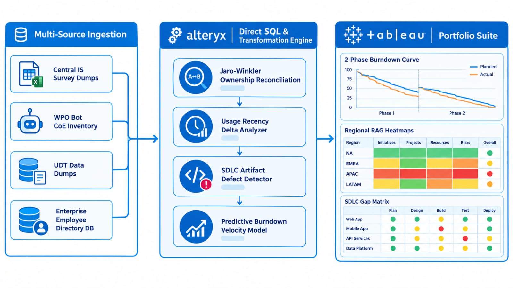
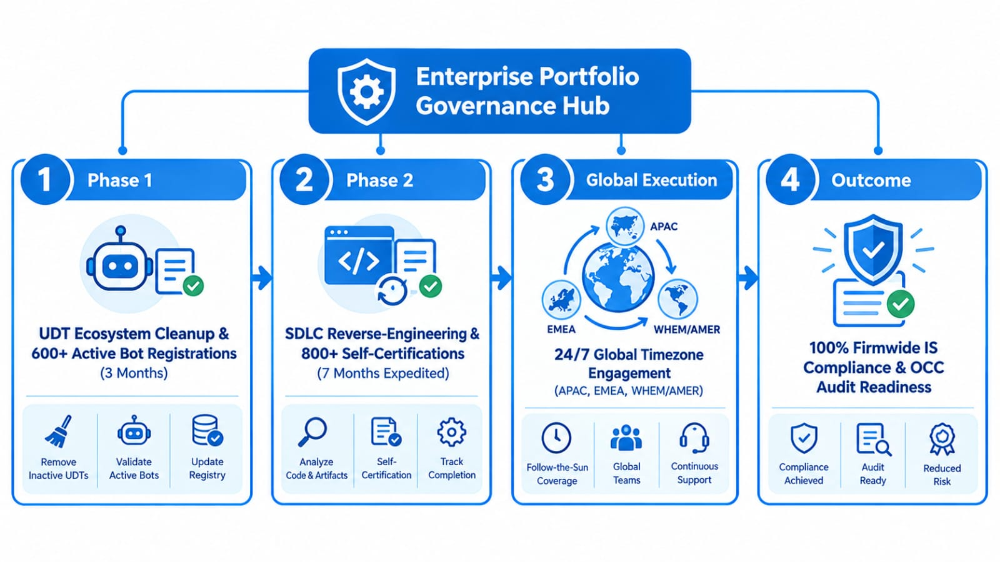

# 🤖 Project 07: Enterprise Automation Portfolio Governance & Compliance Engine (800+ Asset Portfolio)

## Executive Summary:
* **Role:** Lead Project Manager & Senior Data Analytics Executive (WPO CoE)
* **Scope & Program Impact:** Orchestrated a massive 2-phase enterprise governance program to identify, clean, register, document, and certify **800+ bots and automation solutions** across Wholesale Payment Operations (WPO), achieving **100% Firmwide Information Security (IS) compliance** adherence, months ahead of schedule.
* **Phase 1 Execution (03 Months):** Reconciled fragmented survey dumps against WPO Bot CoE inventories, executed a complete User-Developed Tool (UDT) ecosystem cleanup, evaluated last-used timestamp activity, and hand-held busy Ops leadership through registration or decommissioning—resulting in 600+ registered active solutions and setting up WPO for flawless OCC audit readiness.
* **Phase 2 Execution (07 Months vs. 09-Month Target):** Accelerated SDLC reverse-engineering and Ops Solution Owner self-certification across 800+ total solutions in just 07 months. Driven by intense global stakeholder engagement across APAC, EMEA, and WHEM/AMER time zones and deep SDLC mastery, the phase was expedited ahead of an internal transition to CCOR M&T India.

---

## 1. Operational Challenge & 2-Phase Strategy:

### Baseline State & Governance Gaps:
The central Firmwide IS Controls CoE mandated strict registration and certification standards for all bot and automation solutions across the firm. However, WPO faced significant operational friction:
* **Fragmented & Incomplete Inventories:** Initial self-identification surveys run by the central CoE left massive blind spots, with unmapped applications, broken employee/ Legal Entity (LE) linkages, and orphaned tools.
* **Severe Bandwidth Constraints:** Operations leadership operated in a 24x7 high-pressure environment; without dedicated bandwidth, engaging in governance documentation and registration tasks was naturally treated as a low/zero priority.
* **Legacy SDLC Deficits:** Over 90% of active solutions lacked formal SDLC documentation, requiring discovery and reverse-engineering of requirements, UAT results, sign-offs, and architecture artifacts across 800+ unique solutions.
* **Global Stakeholder Complexity:** Solution owners were distributed across global time zones—ranging from APAC, EMEA, and WHEM — requiring round-the-clock coordination, flexibility, and high-touch change management.

### The 2-Phase Governance Roadmap:

```text
┌────────────────────────────────────────────────────────────────────────────────────────┐
│                        PHASE 1: DISCOVERY & REGISTRATION (3 MONTHS)                    │
│  ┌─────────────────────────┐   ┌───────────────────────────┐   ┌────────────────────┐  │
│  │ Ingest Central Survey   │──>│ WPO Bot CoE Reconciliation│──>│ Last-Used Activity │  │
│  │ & UDT Data Dumps        │   │ & LE/Employee Mapping     │   │ Verification Logic │  │
│  └─────────────────────────┘   └───────────────────────────┘   └─────────┬──────────┘  │
└──────────────────────────────────────────────────────────────────────────┼─────────────┘
                                                                           ▼
┌────────────────────────────────────────────────────────────────────────────────────────┐
│               600+ ACTIVE SOLUTIONS REGISTERED & UDT ECOSYSTEM CLEANED                 │
└───────────────────────────────────────────┬────────────────────────────────────────────┘
                                            ▼
┌────────────────────────────────────────────────────────────────────────────────────────┐
│                     PHASE 2: SDLC COMPLIANCE & CERTIFICATION (07 MONTHS)               │
│  ┌─────────────────────────┐   ┌───────────────────────────┐   ┌────────────────────┐  │
│  │ Reverse-Engineering     │──>│ Ops Owner Self-Cert &     │──>│ Global Stakeholder │  │
│  │ SDLC Artifacts & Sign-Offs│ │ Aligned 1LOD Notification │   │ Executive RAG Hub  │  │
│  └─────────────────────────┘   └───────────────────────────┘   └─────────┬──────────┘  │
└──────────────────────────────────────────────────────────────────────────┼─────────────┘
                                                                           ▼
┌────────────────────────────────────────────────────────────────────────────────────────┐
│              100% FIRMWIDE IS COMPLIANCE & CERTIFICATION (800+ ASSETS)                 │
└────────────────────────────────────────────────────────────────────────────────────────┘

```



---

## 2. Deep Dive: Phase 1 & Phase 2 Execution Mechanics:

### Phase 1: UDT Cleanup & Portfolio Registration (Completed Ahead of Deadline):
1. **Multi-Source Reconciliation:** Merged incomplete central survey responses with WPO Bot CoE inventories and UDT database extracts using Alteryx.
2. **Last-Used Activity Analytics:** Calculated last-used timestamps across tools to drive objective, data-backed discussions with solution owners regarding actual usage vs. obsolescence.
3. **Data Cleaning & Entity Mapping:** Executed string-matching and employee roster lookup models to fix broken links across solution owners, manager hierarchies, and Legal Entities (LE's).
4. **Empathetic Change Management & Nudging:** Partnered with WPO executive leadership to issue high-visibility nudge notes, followed by 1-on-1 hand-holding sessions across Australia, EMEA, and NA time zones to navigate registration or decommissioning—resulting in a final registration of 600+ active solutions.
5. **Audit Readiness By-Product:** While bot solutions were the primary in-scope mandate, cleaning up the broader UDT landscape provided immense value to WPO by ensuring 100% readiness for OCC regulatory audits.

### Phase 2: SDLC Reverse-Engineering & 1LOD Certification (7 Months vs. 9-Month Target)
1. **Voluntary Adoption Expansion:** Built organisational awareness through campaigns, causing solution owners to voluntarily register additional tools—expanding the portfolio from *600+* to **800+ Total Solutions**.
2. **Deep SDLC Mastery & Reverse-Engineering:** Personally reviewed and analysed 800+ solutions to uncover historical evidence, recreate Business Requirement Documents (BRD's), System Design Documents (SDD's), UAT test sign-offs, and access control matrices—increasing personal domain expertise in Bot CoE SDLC and Firmwide IS Controls a hundredfold.
3. **Ops Owner Certification Workflow:** Guided Ops Solution Owners through self-certification while ensuring formal notification to aligned 1LOD contacts listed in the central firmwide IS controls application.
4. **Expedited Delivery:** Due to selection for a next role in CCOR M&T India, proactively accelerated the Phase 2 roadmap to complete **full certification across all 800+ solutions in just 07 months** (02 months ahead of schedule) to ensure a seamless portfolio handover.

---

## 3. Advanced Analytical Models & Data Hygiene Methods:

To govern 800+ assets with surgical accuracy, several statistical and analytical models were deployed within the Alteryx/ Tableau pipeline:
* **Fuzzy Ownership Reconciliation (Jaro-Winkler Distance):** Evaluated orphaned tool ownership fields against active Employee Directory records to automatically suggest valid primary/ secondary owners for legacy tools.
* **Usage Recency Delta Modelling:** Automated timestamp delta analysis to identify dormant solutions, enabling logical, evidence-based decommission discussions with solution owners.
* **Predictive Burndown & Velocity Forecasting:** Modelled weekly certification velocity per operational vertical to project target completion dates against the enterprise deadline, triggering automated RAG alerts for lagging units.
* **Anomaly Detection for Missing Artifacts:** Implemented multi-condition validation logic to detect incomplete SDLC packages (e.g., missing UAT sign-off despite production status).
* **Feedback Loop Data Quality Scoring:** Calculated defect-density scores across the central IS database to quantify broken entity links and feed corrective recommendations back to the central Firmwide IS CoE.

---


## 4. Executive Tableau RAG Control Suite:
* **View 1: Portfolio Burndown & Velocity Tracker:** Displays overall 2-phase progress, comparing actual registration/ certification curves against weekly target milestones.
* **View 2: Operational RAG Status & LE Risk Matrix:** Breaks down compliance readiness by WPO vertical and Legal Entity, highlighting high-risk areas for regional LE heads during weekly reviews.
* **View 3: SDLC Artifact Gap Analyser:** Pinpoints exact missing compliance artifacts (BRD's, SDD's, UAT sign-offs, Access Approvals) per solution owner.
* **View 4: Decommissioning & Solution Lifecycle Hub:** Tracks inactive tools flagged for decommissioning through formal sign-off and approval workflows.

---

## 5. Measurable Business Results & Impact:

| Performance Metric | 🛑 Baseline State (Pre-Program) | 🎯 Post-Deployment State | 💡 Strategic Value |
| :--- | :--- | :--- | :--- |
| **Portfolio Coverage** | Fragmented, incomplete survey (~30% visible) | **800+ Total Solutions Catalogued & Governed** | Complete visibility across WPO bot footprint |
| **Phase 1 Registration** | Unstructured self-identification | **600+ Active Solutions Registered** | 1. Successful Bot Registration <br> 2. Full UDT cleanup & OCC audit readiness |
| **Phase 2 Delivery Time** | 09-Month Firmwide Mandate | **100% Certified in 07 Months (Expedited)** | Rapid risk mitigation prior to CCOR transition |
| **SDLC Documentation** | >90% Legacy Solutions Missing Artifacts | **100% Reverse-Engineered Artifact Compliance** | Fully documented, audit-proof application portfolio |
| **Stakeholder Engagement** | Zero bandwidth / low priority due to 24x7 Ops priorities | **100% Global Participation Across Time Zones** | Empathetic change management & tailored 1-on-1 support |

---

## Key Takeaways & Leadership Impact:

* **Global High-Touch Leadership:** Facilitated seamless cross-functional alignment across APAC, EMEA, and WHEM time zones, overcoming severe operational bandwidth constraints through empathetic 1-on-1 support.
* **Exponential Domain Expertise:** Hands-on review and documentation reverse-engineering across 800+ solutions expanded Bot CoE SDLC and Firmwide IS Control mastery a hundredfold.
* **Enterprise Feedback Loop:** Cleaned WPO inventories while providing structural feedback that upgraded the central Firmwide IS database architecture.

